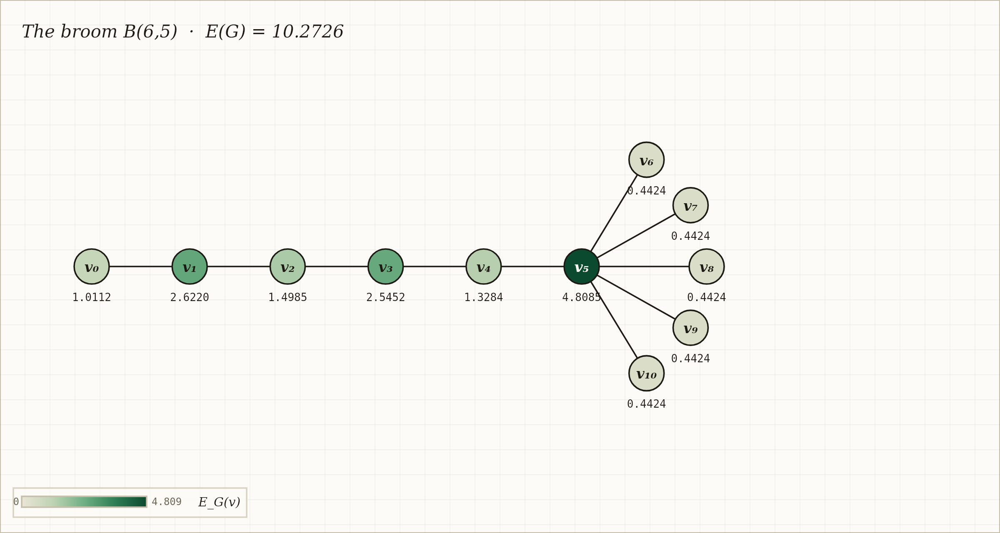

# Atlas de Energía Local de Vértices

[](https://github.com/AndresGomez87/atlas-local-vertex-energy/actions)
[](LICENSE)

**[English version →](README.md)**

Un atlas interactivo para explorar la **energía local de los vértices** de un grafo, un invariante reciente de la teoría espectral de grafos. Dibuja cualquier grafo o genera uno de una familia paramétrica, y observa cómo la energía se distribuye entre los vértices como un mapa de calor en vivo, con el espectro dibujado sobre la recta real y curvas de energía trazadas a lo largo de toda la familia.

**Demo en línea:** https://AndresGomez87.github.io/atlas-local-vertex-energy/



*El broom B(6,5). El hub concentra la mayor energía local (verde profundo) mientras las hojas pendientes cargan la menor. Nótese la intensidad alternante a lo largo del mango.*

## La matemática

La **energía** de un grafo *G* es la suma de los valores absolutos de los eigenvalores de su matriz de adyacencia, E(G) = Σᵢ |λᵢ|, un invariante clásico introducido por Gutman con raíces en la teoría de orbitales moleculares de Hückel. La **energía local de un vértice**, introducida por Espinal y Rada (2024), mide cuánta de esa energía es responsabilidad del vértice:

> E_G(v) = E(G) − E(G − v)

Como la matriz de adyacencia de G − v es una submatriz principal de la de G, el entrelazamiento de eigenvalores da 0 ≤ E_G(v), y Espinal–Rada demuestran la cota superior ajustada E_G(v) ≤ 2√(deg v). La **energía local total** e(G) = Σᵥ E_G(v) satisface e(G) ≤ 2·E(G). El Atlas verifica y muestra las tres cantidades en vivo.

## Funcionalidades

- **Dibujo libre** — clic para colocar vértices, unirlos con aristas, arrastrar, borrar. Todo se recalcula mientras dibujas (hasta n = 30; bajo demanda por encima).
- **Familias paramétricas** — caminos, ciclos, estrellas, grafos completos y bipartitos completos, brooms B(r,q), estrellas dobles S(p,q), double brooms simétricos DB(t,k), y el grafo de Petersen. Un slider por parámetro; el grafo se regenera y se dispone automáticamente. Editar a mano un grafo generado lo desprende a modo libre.
- **Mapa de calor de energía local** — cada vértice se colorea según su E_G(v), con barra de color. La estructura se vuelve visible: los hubs brillan, las hojas palidecen.
- **Espectro sobre la recta real** — eigenvalores como puntos sobre ℝ, apilados por multiplicidad, con puntos huecos en cero. La simetría de los espectros bipartitos se ve de un vistazo, y el pie de figura la anota.
- **Curvas de familia (Fig. 2)** — E(G), e(G), maxᵥ E_G(v) y minᵥ E_G(v) trazadas a lo largo de la familia al barrer un parámetro, computadas progresivamente y con caché. Una regla punteada marca dónde queda el grafo mostrado dentro de su propia familia.
- **URLs compartibles** — `index.html#f=broom&r=4&q=3` reconstruye ese grafo exacto. **Exportación PNG** de la placa con un clic.
- **Cero dependencias** — un único archivo HTML. Toda la pila numérica está implementada desde cero.

## Familias paramétricas

| Familia | Parámetros | Hecho espectral mostrado en la app |
|---|---|---|
| Camino P(n) | n | eigenvalores 2cos(kπ/(n+1)) |
| Ciclo C(n) | n | eigenvalores 2cos(2πk/n); bipartito ssi n par |
| Estrella S(n) | n | espectro ±√(n−1), 0ⁿ⁻²; E = 2√(n−1) |
| Completo K(n) | n | espectro n−1, (−1)ⁿ⁻¹; E = 2(n−1) |
| Bipartito completo K(p,q) | p, q | eigenvalores no nulos ±√(pq); E = 2√(pq) |
| Broom B(r,q) | r, q | el hub maximiza la energía local dentro del grafo |
| Estrella doble S(p,q) | p, q | árbol de diámetro 3 |
| Double broom simétrico DB(t,k) | t, k | simétrico bajo el intercambio de sus dos hubs |
| Grafo de Petersen | — | espectro 3, 1⁵, (−2)⁴; E = 16 |

## Numérica verificada

El motor de eigenvalores es el **algoritmo clásico de rotaciones de Jacobi** para matrices simétricas reales, implementado desde cero en ~40 líneas de JavaScript — con convergencia demostrada y alta precisión para los tamaños que maneja el Atlas. Está probado de tres maneras, y la suite completa corre en CI en cada push:

1. **Formas cerradas** (`tests/verify_engine.js`, `tests/verify_families.js`) — las energías de P_n, C_n, S_n, K_n, K_{p,q}, el grafo de Petersen (E = 16) y el broom B(4,3) (E = 2√(6+2√7)) se comparan contra sus valores exactos, junto con las cotas estructurales 0 ≤ E_G(v) ≤ 2√(deg v) y e(G) ≤ 2E(G) sobre grafos aleatorios.
2. **Cruce contra NumPy** (`tests/cross_check_numpy.py`) — la salida del motor sobre 25 grafos aleatorios se compara con `numpy.linalg.eigvalsh`; la discrepancia máxima observada es ~1e-14.
3. **Barridos de curvas** (`tests/verify_curves.js`) — los puntos de las curvas de familia de la Fig. 2 se validan contra valores conocidos y chequeos de consistencia interna.

```bash
npm test              # suites de JavaScript (sin dependencias)
npm run test:numpy    # cruce contra NumPy (requiere python3 + numpy)
```

## Ejecutar localmente y desplegar

Es un solo archivo — abre `index.html` en un navegador y listo. Para publicar tu propia copia en GitHub Pages:

```bash
git init && git add . && git commit -m "Atlas de energía local de vértices"
git branch -M main
git remote add origin https://github.com/AndresGomez87/atlas-local-vertex-energy.git
git push -u origin main
```

Luego en GitHub: **Settings → Pages → Source: Deploy from a branch → main / (root)**. El sitio aparece en `https://AndresGomez87.github.io/atlas-local-vertex-energy/` en uno o dos minutos.

## Referencias

- C. Espinal, J. Rada, *Graph energy change on vertex deletion* (2024) — definición de la energía local de un vértice y la cota E_G(v) ≤ 2√(deg v).
- I. Gutman, *The energy of a graph* (1978) — la energía clásica de un grafo.

## Autor

Desarrollado por **Andres Gomez**, matemático de la Universidad de Antioquia (Medellín, Colombia), como acompañante de una tesis de pregrado sobre energía local de vértices en familias estructuradas de árboles.

Publicado bajo la [Licencia MIT](LICENSE).
